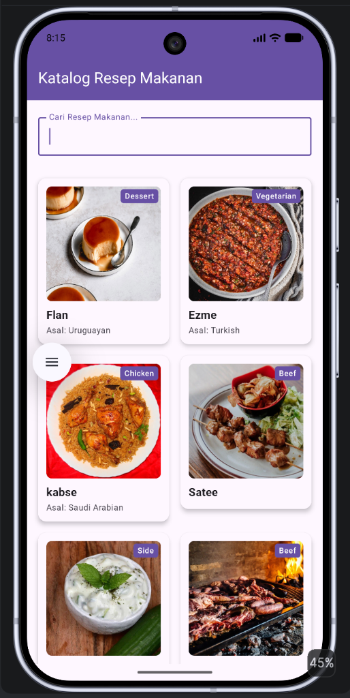
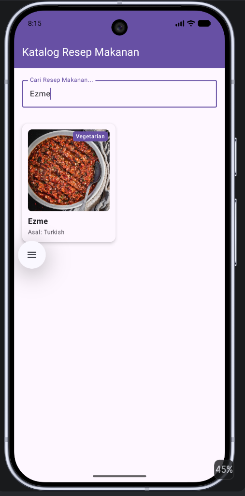
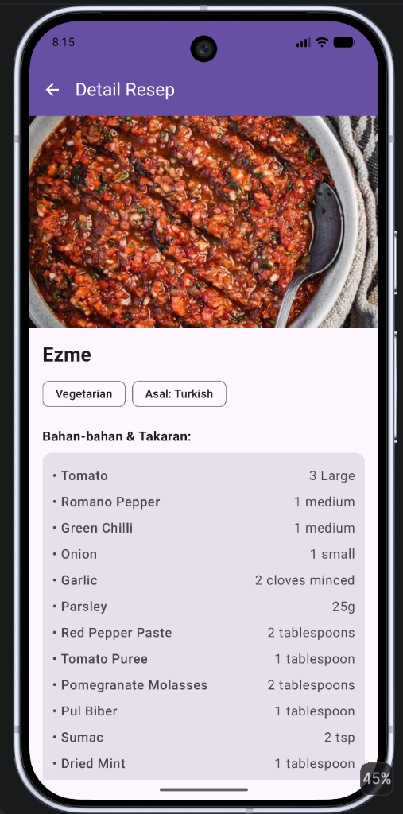

# Aplikasi Katalog dan Eksplorasi Resep Makanan
> ResepKu - Eksplorasi Resep Makanan Lezat Berbasis TheMealDB API

---

## 👤 Identitas Praktikan
- **Nama Lengkap:** Althaf Nadhif Saputra
- **NIM:** H1D024108
- **Shift Awal:** Shift E
- **Shift Akhir:** Shift E
- **Link Video Demo/Penjelasan:** https://youtu.be/gToZof3FMKQ

---

## 📱 Deskripsi Aplikasi
Aplikasi Katalog dan Eksplorasi Resep Makanan merupakan aplikasi Android modern yang dikembangkan menggunakan Jetpack Compose dan arsitektur MVVM. Aplikasi ini terhubung langsung secara real-time ke REST API TheMealDB untuk memudahkan pengguna mencari berbagai resep makanan, melihat kategori, serta mendapatkan informasi lengkap mengenai bahan-bahan, takaran, dan langkah-langkah instruksi memasak.

---

## 🛠️ Penjelasan Teknis

### 1. Spesifikasi & Tech Stack
- **Bahasa:** Kotlin 2.0
- **UI Framework:** Jetpack Compose (Material 3)
- **Min SDK:** 24 (Android 7.0) | **Target SDK:** 35 (Android 15)
- **Pola Arsitektur:** MVVM (Model-View-ViewModel)
- **Library Utama:**
  - `Navigation Compose` (Routing & Navigasi Antar Halaman)
  - `ViewModel` & `StateFlow` (State Management & Reactive UI)
  - `Retrofit` & `Gson` (Networking & JSON Parsing REST API)
  - `Coil` (Asynchronous Image Loading)
  - `Kotlin Coroutines` (Asynchronous Processing)

### 2. Fitur Utama
- **Katalog Resep Makanan:** Menampilkan daftar resep makanan dalam bentuk grid interaktif.
- **Pencarian Real-Time:** Fitur pencarian resep makanan berdasarkan kata kunci dengan integrasi endpoint TheMealDB.
- **Detail Resep Lengkap:** Menampilkan informasi rinci berupa gambar, kategori, asal makanan, daftar bahan beserta takaran, serta instruksi memasak secara terstruktur.

### 3. Struktur Direktori Proyek
```text
app/src/main/java/com/example/katalogresep/
├── data/
│   ├── model/
│   │   └── Meal.kt
│   └── repository/
│       └── RecipeRepository.kt
├── network/
│   └── MealApiService.kt
├── ui/
│   ├── screen/
│   │   ├── HomeScreen.kt
│   │   └── RecipeDetailScreen.kt
│   └── viewmodel/
│       ├── RecipeViewModel.kt
│       └── RecipeDetailViewModel.kt
└── MainActivity.kt
```

---

## 📸 Tangkapan Layar (Screenshots)

| Screen 1 (Katalog Utama) | Screen 2 (Pencarian Resep) | Screen 3 (Detail Resep) |
| :---: | :---: | :---: |
|  |  |  |

---

## 🚀 Cara Menjalankan Proyek

1. **Prasyarat:**
   - Android Studio (Koala / Ladybug / versi terbaru disarankan).
   - JDK 17 atau JDK 21.
   - Perangkat fisik Android dengan USB Debugging aktif atau Emulator (API 24+).

2. **Langkah:**
   ```bash
   # Clone repository
   git clone https://github.com/N4thaf/Responsi_PemrogramanMobile_H1D024108.git

   # Masuk ke folder proyek
   cd Responsi_PemrogramanMobile_H1D024108
   ```

3. Buka folder proyek di **Android Studio**.
4. Tunggu proses **Gradle Sync** selesai.
5. Pilih target perangkat/emulator, lalu klik tombol **Run** (`Shift + F10`).
